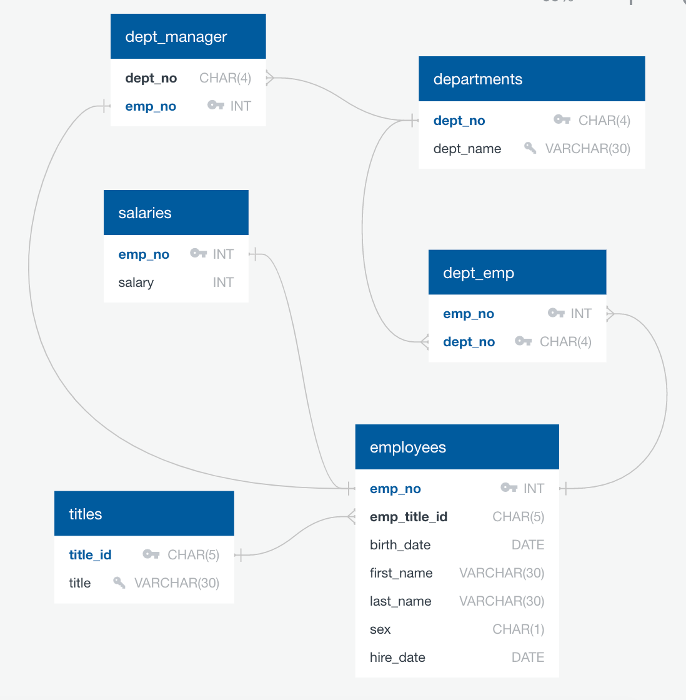

# sql-challenge

Completed sql (week 9) homework for Monash University Data Analytics Boot Camp.

Homework task is to draw up an entity relationship diagram (ERD) of the 6 provided csv files, and use sql to create a table schema, import the respective tables, and run a number of queries to explore the provided data.

* Folder structure include -
	* **data** folder - contains the 6 csv files needed for sql homework
    * **table_erd.png** file - showing the entity relationship diagram (ERD) generated from [QuickDBD](http://www.quickdatabasediagrams.com).
        
	* **sqlfiles** folder - contains the two main sql files
        * **schema.sql** file - creates respective tables for the 6 csv files
        * **queries.sql** file - runs the necessary queries
	* **sql_challenge.ipynb** file - Jupyter notebook to import the sql database into Pandas, and generate a number of figures visualising the data.